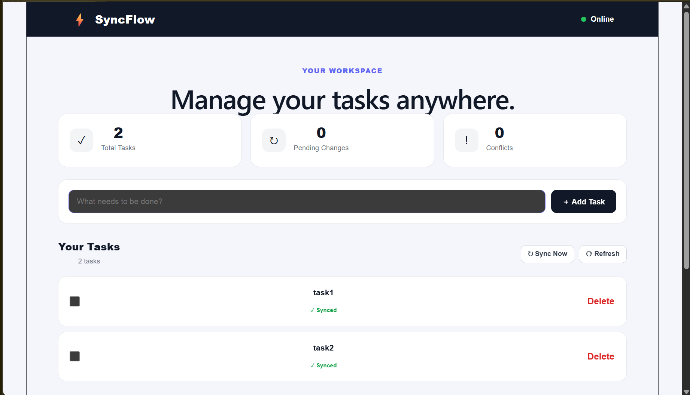
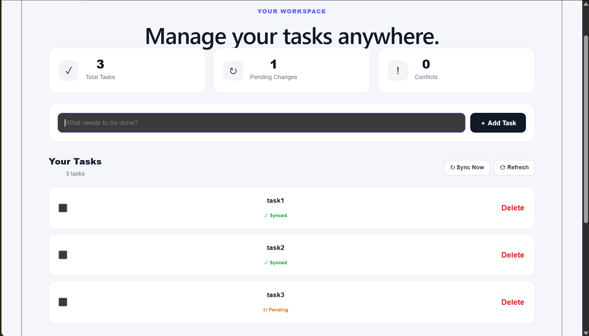
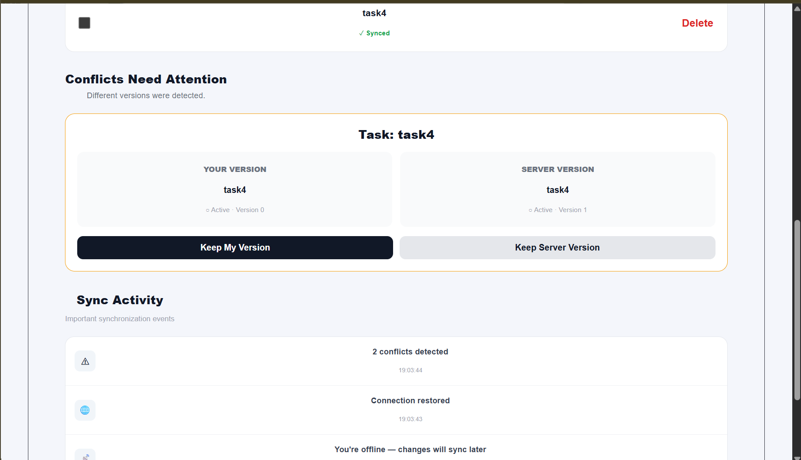
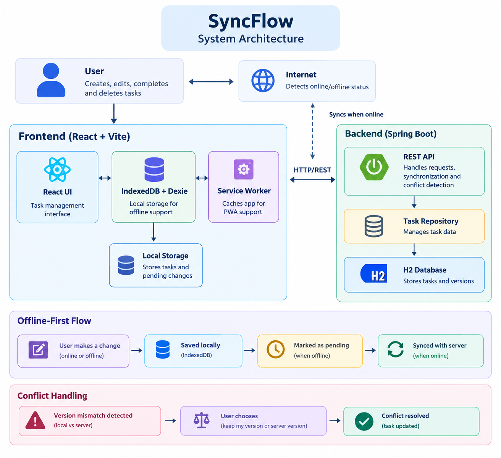

# SyncFlow

## Offline-First Task Manager

SyncFlow is a task management application that allows users to create, edit, complete, and delete tasks even when there is no internet connection.

Changes are stored locally and synchronized with the server when the connection is restored. The application also detects conflicting changes and allows the user to choose which version to keep.

## Features

* Offline task management
* Create, edit, complete, and delete tasks
* Local data storage using IndexedDB
* Pending changes tracking
* Automatic synchronization
* Online and offline status detection
* Conflict detection and resolution
* Progressive Web App support

## Technology Stack

* React
* Vite
* JavaScript
* IndexedDB
* Dexie
* Java
* Spring Boot
* H2 Database
* REST API
* Service Worker

## Prerequisites

Before running the project, make sure the following are installed:

* Java 17 or later
* Node.js 18 or later
* npm
* Git (optional)
* VS Code or any code editor

Check the installed versions:

java -version
node -v
npm -v
git --version

Maven does not need to be installed separately because the backend includes the Maven Wrapper.

## Project Structure

algo_hack/
│
├── frontend/
│   ├── public/
│   │   ├── manifest.webmanifest
│   │   └── sw.js
│   │
│   └── src/
│       ├── db/
│       │   └── database.js
│       ├── App.jsx
│       ├── main.jsx
│       └── index.css
│
├── backend/
│   ├── src/
│   │   └── main/
│   │       └── java/
│   │           └── com/example/backend/
│   │               ├── controller/
│   │               │   └── TaskController.java
│   │               ├── model/
│   │               │   └── Task.java
│   │               └── repository/
│   │                   └── TaskRepository.java
│   │
│   ├── pom.xml
│   └── mvnw.cmd
│
└── README.md

## How It Works

When a user creates or updates a task, the change is first stored locally in IndexedDB.

If the application is offline, the change remains marked as pending. When the connection is restored, SyncFlow sends the pending changes to the Spring Boot backend.

The backend stores the synchronized tasks in the H2 database.

For conflicting updates, SyncFlow uses task version numbers. If the version stored on the device does not match the server version, a conflict is detected instead of silently overwriting the existing data.

## Setup

### Backend

Open a terminal in the backend directory:

cd backend
./mvnw spring-boot:run

On Windows:

cd backend
.\mvnw.cmd spring-boot:run

The backend runs on:

http://localhost:8080

### Frontend

Open another terminal:

cd frontend
npm install
npm run dev

The frontend normally runs on:

http://localhost:5173

## Testing

The application was tested for:

* Creating tasks while online and offline
* Editing tasks while online and offline
* Completing and uncompleting tasks
* Deleting tasks while offline
* Tracking pending changes
* Synchronizing changes after reconnecting
* Detecting conflicting versions
* Resolving conflicts using local or server versions

## Future Improvements

Possible future improvements include:

* User authentication
* Multi-device synchronization
* Cloud deployment
* Production database such as PostgreSQL
* Smarter conflict merging
* Real-time synchronization
* Background synchronization
## Screenshots

### 1. Normal Synchronized State

This screenshot shows the application in its normal online state. The tasks are available in the workspace and the sync status shows that the changes have been successfully synchronized with the server.

### 2. Offline Changes and Pending Sync

This screenshot shows SyncFlow working without an internet connection. New or modified tasks are stored locally, and the **Pending Changes** count indicates that these changes are waiting to be synchronized.

Once the connection is restored, SyncFlow automatically sends the pending changes to the server.

---

### 3. Conflict Detection and Resolution

SyncFlow also handles situations where the same task has been changed in different places.

Instead of silently overwriting one version, the application detects the version mismatch and displays both the **Your Version** and **Server Version**. The user can then choose whether to keep their version or the server version.

## Architecture

Work first. Sync later.
